<div align="center">
  
</div>

---

```shell
# Protocol : TLS 1.3  |  Cipher  : AES-256-GCM  |  Auth: ED25519
# Cert     : VALID    |  Chain   : VERIFIED      |  OCSP: STAPLED
# Session  : 0xA8F3D2 |  uid     : david.moura   |  role: security.engineer

> ACCESS GRANTED — SENTINEL NODE ONLINE
```

---

```
ROOT@DAVIDMOURA:~# whoami
```

<div align="center">

### 🦀 Backend Architect · 🛡️ Cybersecurity Specialist · 🐧 Linux Systems

*Java/Spring para throughput enterprise. Rust para memory safety e performance extrema.*
*Segurança não é feature — é arquitetura.*

</div>

---

```
ROOT@DAVIDMOURA:~# system_stats
```

<div align="center">

|  |  |
|:---:|:---:|
|  |  |

</div>

---

```
ROOT@DAVIDMOURA:~# tech_stack --categorized
```

| ⚙️ Core Systems | 🛡️ Security Layer | 🐧 Infrastructure |
|:---|:---|:---|
| 🦀 Rust · Tokio · Axum · SQLx | AppSec · OWASP Top 10 | GNU/Linux · Kernel Tinkering |
| ☕ Java 21 · Loom · Virtual Threads | DevSecOps · Zero Trust Arch | 🐳 Docker · Container Security |
| Spring Boot 3.4+ · Spring Security | Pentest Web/API | Nginx · WireGuard · iptables |
| 🐚 Bash · Shell Scripting | Cryptography · AES · RSA · ECDSA | PostgreSQL 16 · Secure Schema |
| Actix-web · REST · JSON APIs | JWT · OAuth2 · mTLS · TLS 1.3 | CI/CD · Trivy · Docker Scout |

---

```
ROOT@DAVIDMOURA:~# ls -la projects/
```

| ⚙️ Project | Stack | 🛡️ Security Posture | Status |
|:---|:---|:---|:---:|
| **[secure-auth-api](https://github.com/DavidHMoura/secure-auth-api)** | Spring Security 6 · JWT | Token rotation · reuse detection | `STABLE` |
| **[sentinelops](https://github.com/DavidHMoura/sentinelopsproject)** | 🦀 Rust · Axum · PostgreSQL | Memory-safe · threat ingestion engine | `REFACTORING` |
| **[compliance-risk-engine](https://github.com/DavidHMoura/compliance-risk-engine)** | Java 21 · Playwright | Zero attack surface · immutable audit log | `STABLE` |
| **[linux-security-scripts](https://github.com/DavidHMoura)** | Bash · 🦀 Rust | OS hardening · system auditing | `ACTIVE` |

---

<div align="center">

> *"Talk is cheap. Show me the code."* — **Linus Torvalds**

</div>

---

```
ROOT@DAVIDMOURA:~# connect
```

<div align="center">

[](https://www.linkedin.com/in/david-h-moura-457063304/)
[](https://github.com/DavidHMoura)
[](https://github.com/DavidHMoura?tab=followers)

</div>

---

```
ROOT@DAVIDMOURA:~# exit
```

```shell
# [SESSION LOG]
# identity  : David Moura           [VERIFIED]
# integrity : SHA-512 checksum      [PASSED]
# cipher    : AES-256-GCM           [INTACT]
# errors    : 0
# warnings  : 0
#
# Connection encrypted via TLS 1.3
# Session closed. Stay secure.
```
